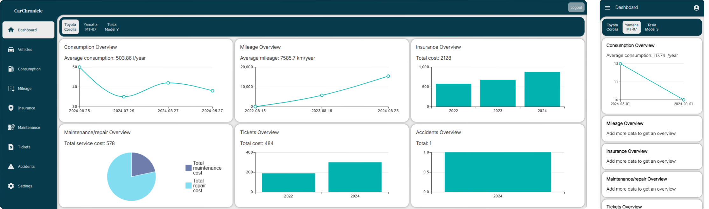

# CarChronicle

CarChronicle is a web application to store and manage personal vehicle data. Users can track mileage and consumption as well as store insurance, accident and ticket information. These logs can be stored for personal records or provided to potential buyers when selling the vehicle.

The application uses [**React**](https://react.dev/) for UI components and is built with [**Next.js**](https://nextjs.org/) (w/ app router). For application wide state management [**Redux**](https://redux.js.org/) is used. Backend is implemented as a [**PostgREST**](https://docs.postgrest.org/en/v12/) API which is based on a [**PostgreSQL**](https://www.postgresql.org/) database running on [**Supabase**](https://supabase.com/).

The UI is designed as a combination of information cards which stacks in masonry layout.

[**Visit**](https://carchronicleweb.vercel.app)

## Screenshots

